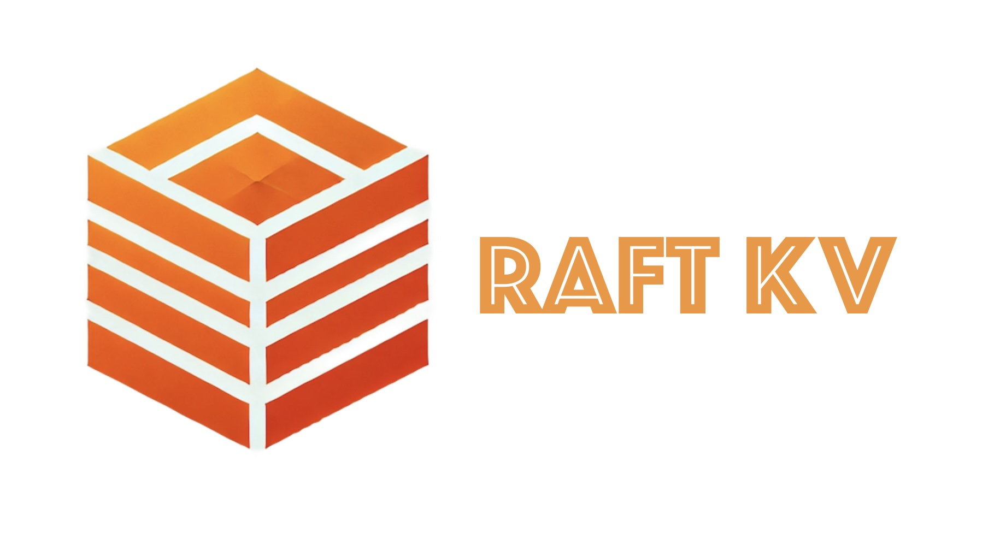

+++
date = '2024-11-12T11:56:43-08:00'
draft = false
title = 'Raft KV'
type = "page"
description = 'A distributed KV database in C++'
tags = ['C++', 'Raft', 'Boost']
# featured_image = "/images/raft-kv-icon.webp"
# link = "https://github.com/dionysusliu/raft-kv-study"
+++

## Explore on GitHub: [Raft-KV](https://github.com/dionysusliu/raft-kv-study)

## About this project:
Distributed storage services are the backbone of modern Internet applications. However, building a robust distributed storage service from scratch is challenging, particularly in orchestrating the subtle cases in distributed consensus. 

The **Raft-KV** addresses this by providing an **abstract Raft consensus layer** that can be integrated with **any** key-value (KV) storage engine. This separation of concerns between the storage layer and the distributed consensus layer enhances modularity, making it easier and more efficient for developers to build reliable storage clusters. 

The project's goal is to enable developers to build **robust** distributed storage clusters by simply **"plugging"** their custom KV storage engine into the Raft consensus layer. This provides a flexible and reliable solution for distributed data management. 

this project serves as a comprehensive study of distributed systems, consensus algorithms, and modern C++ development.

### Key Features:
- Consensus Algorithm:
    - Implemented the **Raft** consensus protocol to handle **leader election**, **log replication**, and **fault recovery**.

- Networking:
    - Leveraged **Boost Asio** to implement an event-driven, asynchronous network model for efficient message passing and communication within the cluster.

- Testing and Quality Assurance:
    - **GTest** for test environment
        - Comprehensive **unit testing** for individual components.
        - **Integration testing** across multiple nodes in a mocked cluster environment.
    - Memory checks using **AddressSanitizer (ASan)**.
    - Performance profiling with **gprof** and **FlameGraph** to identify and optimize bottlenecks.